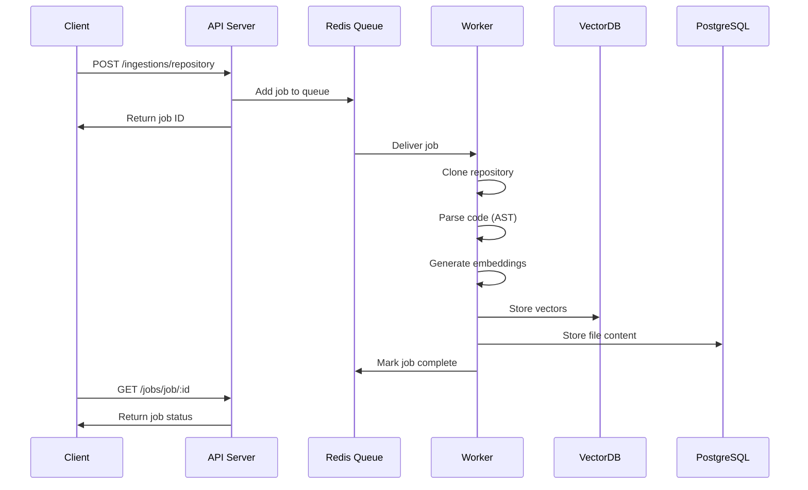
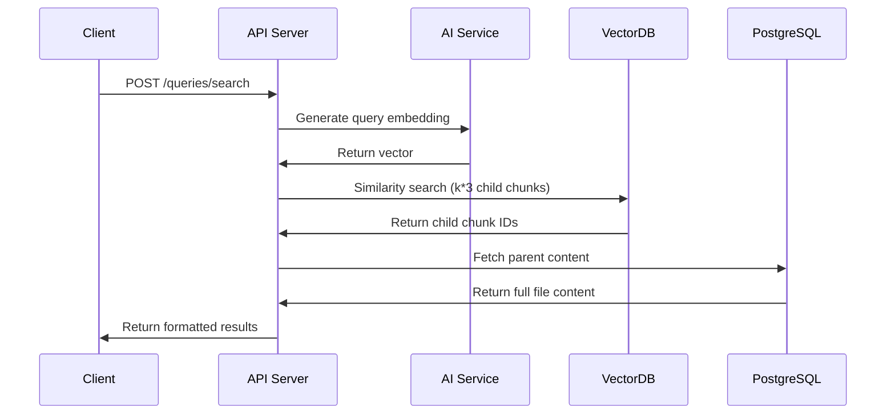
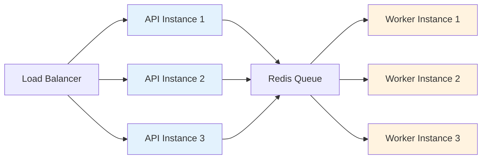

# 🕳️ Rephole

> **RAG-powered code search via simple REST API**

---

## 🎯 What is Rephole?

Rephole is an open-source REST API that ingests your codebase and creates a specialized RAG (Retrieval-Augmented Generation) system for intelligent code search, and retrievial.

Unlike traditional code search tools, Rephole understands **semantic relationships** in your code, enabling you to:

- 🔍 Search code by intent, not just keywords
- 💬 Ask natural language questions about your codebase
- 🔗 Integrate AI coding assistants into your own products

---

## ✨ Features

- **🚀 Simple REST API** - Integrate in minutes with any tech stack
- **📦 Multi-Repository Support** - Index and query across multiple codebases
- **🎨 OpenAI Embeddings** - Powered by `text-embedding-3-small` model
- **💾 Local Vector Database** - ChromaDB for fast semantic search
- **🐳 One-Click Deployment** - Docker Compose setup in under 5 minutes
- **🔒 Self-Hostable** - Keep your code private with on-premise deployment
- **⚡ Parent-Child Retrieval** - Smart chunking returns full file context

---

## 🚀 Quick Start

### Prerequisites

- Docker & Docker Compose
- Git
- An OpenAI API key

### Installation

**Option 1: Docker Compose**

```bash
# Clone the repository
git clone https://github.com/twodHQ/rephole.git
cd rephole

# Configure your environment
cp .env.example .env
# Edit .env and add your OPENAI_API_KEY

# Start Rephole
docker-compose up -d

# Rephole is now running at http://localhost:3000
```

---

### Your First Query (60 seconds)

```bash
# 1. Ingest a repository
curl -X POST http://localhost:3000/ingestions/repository \
  -H "Content-Type: application/json" \
  -d '{
    "repoUrl": "https://github.com/nestjs/nest.git",
    "ref": "master"
  }'

# Response: Job queued
{
  "status": "queued",
  "jobId": "01HQZX3Y4Z5A6B7C8D9E0F1G2H",
  "repoUrl": "https://github.com/nestjs/nest.git",
  "ref": "master"
}

# 2. Check ingestion status
curl http://localhost:3000/jobs/job/01HQZX3Y4Z5A6B7C8D9E0F1G2H

# Response: Job processing
{
  "id": "01HQZX3Y4Z5A6B7C8D9E0F1G2H",
  "state": "active",
  "progress": 45,
  "data": {
    "repoUrl": "https://github.com/nestjs/nest.git",
    "ref": "master"
  }
}

# 3. Search your codebase (once completed)
curl -X POST http://localhost:3000/queries/search \
  -H "Content-Type: application/json" \
  -d '{
    "prompt": "How do I create a custom decorator?",
    "k": 5
  }'

# Response: Relevant code chunks with full file context
{
  "results": [
    "\n        === FILE: 01HQZX3Y4Z5A6B7C8D9E0F1G2H ===\n        export function CustomDecorator() { ... }\n        =====================\n      "
  ]
}
```

---

---

## 📖 Core Concepts

### Ingestion Pipeline

```
Repository → Clone → Parse → Chunk → Embed → Store → Index
```

Rephole automatically:
- Clones your repository
- Parses code files (supports 20+ languages)
- Chunks code intelligently (function/class level)
- Generates embeddings
- Stores vectors
- Indexes for fast retrieval

### Query Flow

```
Question → Embed → Search → Retrieve → Return
```

When you query:
- Your question is embedded using the same model
- Semantic search finds relevant code chunks
- Return top matches chunks

---

## 🔧 API Reference

### Base URL
```
http://localhost:3000
```

### Endpoints

#### 1. Health Check
```http
GET /health
```

**Response:**
```json
{
  "status": "ok"
}
```

---

#### 2. Ingest Repository
```http
POST /ingestions/repository
```

**Request Body:**
```json
{
  "repoUrl": "https://github.com/username/repo.git",
  "ref": "main",           // Optional: branch/tag/commit (default: main)
  "token": "ghp_xxx",      // Optional: for private repos
  "userId": "user-123",   // Optional: for tracking
  "repoId": "my-repo"     // Optional: custom identifier
}
```

**Response:**
```json
{
  "status": "queued",
  "jobId": "01HQZX3Y4Z5A6B7C8D9E0F1G2H",
  "repoUrl": "https://github.com/username/repo.git",
  "ref": "main"
}
```

---

#### 3. Get Job Status
```http
GET /jobs/job/:jobId
```

**Response:**
```json
{
  "id": "01HQZX3Y4Z5A6B7C8D9E0F1G2H",
  "state": "completed",  // queued | active | completed | failed
  "progress": 100,
  "data": {
    "repoUrl": "https://github.com/username/repo.git",
    "ref": "main"
  }
}
```

---

#### 4. Search Code (Semantic)
```http
POST /queries/search
```

**Request Body:**
```json
{
  "prompt": "How does authentication work?",
  "k": 5  // Optional: number of results (default: 5, max: 100)
}
```

**Response:**
```json
{
  "results": [
    "\n        === FILE: 01HQZX... ===\n        [Full file content with relevant code]\n        =====================\n      "
  ]
}
```

**Notes:**
- Uses parent-child retrieval: searches small chunks, returns full parent documents
- The `k` parameter is multiplied by 3 internally for child chunk search
- Returns formatted strings with file context

---

#### 5. Get Failed Jobs
```http
GET /jobs/failed
```

**Response:**
```json
{
  "failedJobs": [
    {
      "id": "01HQZX3Y4Z5A6B7C8D9E0F1G2H",
      "failedReason": "Repository not found",
      "data": { ... }
    }
  ]
}
```

---

#### 6. Retry Failed Job
```http
POST /jobs/retry/:jobId
```

**Response:**
```json
{
  "message": "Job re-queued successfully",
  "jobId": "01HQZX3Y4Z5A6B7C8D9E0F1G2H"
}
```

---

#### 7. Retry All Failed Jobs
```http
POST /jobs/retry/all
```

**Response:**
```json
{
  "message": "All failed jobs re-queued",
  "count": 3
}
```

---

## 🏗️ Architecture

Rephole uses a **producer-consumer architecture** with two separate services for optimal performance and scalability:

### Architecture Components

#### 1. **API Server** (Producer)
- **Purpose:** Handle HTTP requests and enqueue background jobs
- **Port:** 3000
- **Responsibilities:**
  - Accept repository ingestion requests
  - Add jobs to BullMQ queue
  - Provide job status endpoints
  - Handle semantic search queries
  - Return results to clients
- **Does NOT:** Process repositories or perform heavy computations

#### 2. **Background Worker** (Consumer)
- **Purpose:** Process repository ingestion jobs asynchronously
- **Port:** 3002
- **Responsibilities:**
  - Clone repositories
  - Parse code files (AST analysis)
  - Generate AI embeddings
  - Store vectors in ChromaDB
  - Update metadata in PostgreSQL
- **Does NOT:** Handle HTTP requests or API calls

#### 3. **Redis Queue** (BullMQ)
- **Purpose:** Reliable job queue between API and Worker
- **Features:**
  - Job persistence
  - Automatic retries (3 attempts)
  - Exponential backoff
  - Job status tracking
  - Failed job management

#### 4. **Vector Database** (ChromaDB)
- **Purpose:** Store and search code embeddings
- **Features:**
  - Fast semantic search
  - Similarity scoring
  - Metadata filtering

#### 5. **PostgreSQL**
- **Purpose:** Store file content and metadata
- **Data:**
  - Repository state
  - File contents (full source code)
  - Processing metadata
  - Job history

### Data Flow

**Repository Ingestion:**


**Semantic Search:**


### Scaling Strategy

**Horizontal Scaling:**



**Scale API:** Based on HTTP traffic
```bash
docker-compose up --scale api=3
```

**Scale Worker:** Based on queue length
```bash
docker-compose up --scale worker=5
```

### Technology Stack

**Backend Framework:**
- NestJS 11.0 (TypeScript)
- BullMQ 5.63 (Job Queue)

**Databases:**
- PostgreSQL (Metadata & Content)
- ChromaDB 3.1 (Vector Storage)
- Redis (Queue & Cache)

**AI/ML:**
- OpenAI API (`text-embedding-3-small` model)
- Tree-sitter (AST Parsing for code structure)

**Infrastructure:**
- Docker & Docker Compose
- pnpm (Package Manager)

---

## 🛠️ Configuration

### Environment Variables

Create a `.env` file in the project root:

```env
# API Server
PORT=3000
NODE_ENV=production

# Database
POSTGRES_HOST=localhost
POSTGRES_PORT=5432
POSTGRES_USER=rephole
POSTGRES_PASSWORD=your_secure_password
POSTGRES_DB=rephole

# Redis (Queue & Cache)
REDIS_HOST=localhost
REDIS_PORT=6379

# ChromaDB (Vector Store)
CHROMA_HOST=localhost
CHROMA_PORT=8000
CHROMA_COLLECTION_NAME=rephole-collection

# OpenAI API
OPENAI_API_KEY=sk-your-api-key-here
OPENAI_ORGANIZATION_ID=your-org-id        # Optional
OPENAI_PROJECT_ID=your-project-id        # Optional

# Vector Store Configuration
VECTOR_STORE_BATCH_SIZE=1000

# Local Storage
LOCAL_STORAGE_PATH=repos

# Knowledge Base
SHORT_TERM_CONTEXT_WINDOW=20

# Logging
LOG_LEVEL=debug
```

---

## 🐳 Deployment

### Development (Local)

**Start individual services:**

```bash
# Terminal 1: API Server
pnpm install
pnpm start:api:dev

# Terminal 2: Background Worker
pnpm start:worker:dev

# Terminal 3: Infrastructure (Redis, PostgreSQL, ChromaDB)
docker-compose up redis postgres chromadb
```

### Production (Docker Compose)

**Full stack deployment:**

```bash
# Build and start all services
docker-compose up -d

# Check service status
docker-compose ps

# View logs
docker-compose logs -f api
docker-compose logs -f worker

# Scale services
docker-compose up -d --scale worker=3  # Add more workers
docker-compose up -d --scale api=2     # Add more API instances
```

**Example `docker-compose.yml`:**

```yaml
version: '3.8'

services:
  # PostgreSQL
  postgres:
    image: postgres:15-alpine
    environment:
      POSTGRES_USER: rephole
      POSTGRES_PASSWORD: ${POSTGRES_PASSWORD}
      POSTGRES_DB: rephole
    volumes:
      - postgres_data:/var/lib/postgresql/data
    ports:
      - "5432:5432"
    healthcheck:
      test: ["CMD-SHELL", "pg_isready -U rephole"]
      interval: 10s
      timeout: 5s
      retries: 5

  # Redis
  redis:
    image: redis:7-alpine
    ports:
      - "6379:6379"
    volumes:
      - redis_data:/data
    command: redis-server --appendonly yes
    healthcheck:
      test: ["CMD", "redis-cli", "ping"]
      interval: 10s
      timeout: 3s
      retries: 5

  # ChromaDB
  chromadb:
    image: chromadb/chroma:latest
    ports:
      - "8000:8000"
    volumes:
      - chroma_data:/chroma/chroma
    environment:
      - IS_PERSISTENT=TRUE

  # API Server (Producer)
  api:
    build:
      context: .
      dockerfile: Dockerfile.api
    ports:
      - "3000:3000"
    environment:
      - NODE_ENV=production
      - POSTGRES_HOST=postgres
      - REDIS_HOST=redis
      - CHROMA_HOST=chromadb
      - OPENAI_API_KEY=${OPENAI_API_KEY}
    depends_on:
      postgres:
        condition: service_healthy
      redis:
        condition: service_healthy
      chromadb:
        condition: service_started
    restart: unless-stopped

  # Background Worker (Consumer)
  worker:
    build:
      context: .
      dockerfile: Dockerfile.worker
    environment:
      - NODE_ENV=production
      - POSTGRES_HOST=postgres
      - REDIS_HOST=redis
      - CHROMA_HOST=chromadb
      - OPENAI_API_KEY=${OPENAI_API_KEY}
      - MEMORY_MONITORING=true
    depends_on:
      postgres:
        condition: service_healthy
      redis:
        condition: service_healthy
      chromadb:
        condition: service_started
    restart: unless-stopped
    deploy:
      replicas: 2  # Run 2 workers by default

volumes:
  postgres_data:
  redis_data:
  chroma_data:
```

### Monitoring

**Check Queue Status:**

```bash
# Connect to Redis
docker exec -it <redis-container> redis-cli

# View queue statistics
KEYS bull:repo-ingestion:*
LLEN bull:repo-ingestion:waiting
LLEN bull:repo-ingestion:active
LLEN bull:repo-ingestion:completed
LLEN bull:repo-ingestion:failed
```

**View Worker Logs:**

```bash
# Follow worker logs
docker-compose logs -f worker

# Should see:
# [RepoUpdateProcessor] Starting repo ingestion job xxx
# [RepoUpdateProcessor] Processing 123 files
# [RepoUpdateProcessor] ✅ Completed in 45s
```

**API Health Check:**

```bash
curl http://localhost:3000/health

# Response:
{
  "status": "ok"
}
```
