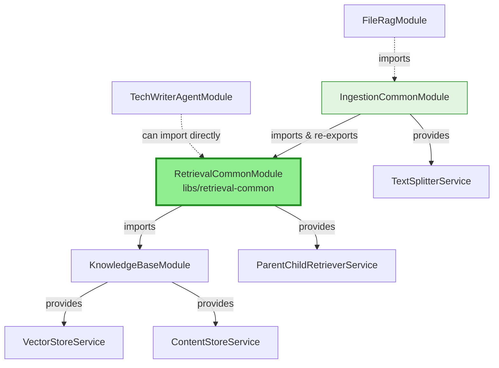

# Retrieval Common Module

## Purpose

The `RetrievalCommonModule` provides retrieval services that combine vector search with content fetching. This module was extracted from `IngestionCommonModule` to create better separation of concerns and reduce unnecessary coupling.

## Design Philosophy

### Why Extract Retrieval Services?

**Problem:** `IngestionCommonModule` was doing too much:
```
IngestionCommonModule
  ├── Text utilities (TextSplitterService) ✅ Lightweight
  └── Retrieval services (ParentChildRetrieverService) ❌ Heavy (needs stores)
```

This forced any module importing `IngestionCommonModule` to also pull in `KnowledgeBaseModule`, even if they only needed text utilities.

**Solution:** Separate retrieval concerns into a focused module:
```
IngestionCommonModule
  └── Text utilities only ✅ Lightweight

RetrievalCommonModule  
  └── Retrieval services ✅ Focused, explicit dependencies
```

### Principles

1. **Separation of Concerns** - Retrieval logic separated from text processing
2. **Explicit Dependencies** - Only imports what's needed (store services)
3. **Reusability** - Can be used independently by any module
4. **No Circular Dependencies** - Clean dependency graph

## Exported Services

### ParentChildRetrieverService

Retrieves full document context by first matching small chunks (children), then returning their parent documents.

**Responsibilities:**
- Vector similarity search using pre-computed embeddings
- Parent document fetching from content store
- Deduplication of parent IDs

**Usage Pattern:**
```typescript
import { RetrievalCommonModule, ParentChildRetrieverService } from '@app/retrieval-common';
import { EmbeddingsService } from '@app/ai-core';

@Module({
  imports: [RetrievalCommonModule, AiFoundationModule],
})
export class YourFeatureModule {}

@Injectable()
export class YourService {
  constructor(
    private retriever: ParentChildRetrieverService,
    private embeddings: EmbeddingsService,
  ) {}

  async search(query: string) {
    // 1. Embed the query
    const [queryVector] = await this.embeddings.embedDocuments([query]);
    
    // 2. Retrieve parent documents
    const results = await this.retriever.retrieve(queryVector, 5);
    
    return results;
  }
}
```

## Usage

### Direct Import (Recommended)

If you only need retrieval services:

```typescript
import { Module } from '@nestjs/common';
import { RetrievalCommonModule } from '@app/retrieval-common';

@Module({
  imports: [RetrievalCommonModule],
})
export class YourModule {}
```

### Via IngestionCommonModule (Backward Compatibility)

For backward compatibility, `IngestionCommonModule` re-exports `RetrievalCommonModule`:

```typescript
import { Module } from '@nestjs/common';
import { IngestionCommonModule } from '@app/ingestion/common';

@Module({
  imports: [IngestionCommonModule],
  // You get both TextSplitterService AND ParentChildRetrieverService
})
export class YourModule {}
```

**Note:** If you only need text utilities, import `IngestionCommonModule`. If you only need retrieval, import `RetrievalCommonModule` directly.

## Migration Guide

### From IngestionCommonModule

If you were importing `IngestionCommonModule` only for `ParentChildRetrieverService`:

**Before:**
```typescript
import { IngestionCommonModule, ParentChildRetrieverService } from '@app/ingestion/common';

@Module({
  imports: [IngestionCommonModule], // Pulls in unnecessary dependencies
})
```

**After:**
```typescript
import { RetrievalCommonModule, ParentChildRetrieverService } from '@app/retrieval-common';

@Module({
  imports: [RetrievalCommonModule], // Lighter, more explicit
})
```

### Service Import Paths

The service can be imported from either location (for backward compatibility):

```typescript
// New path (recommended)
import { ParentChildRetrieverService } from '@app/retrieval-common';

// Old path (still works via re-export)
import { ParentChildRetrieverService } from '@app/ingestion/common';
```

## Architecture



## Dependencies

### Imports
- `KnowledgeBaseModule` - For `VectorStoreService` and `ContentStoreService`

### Exports
- `ParentChildRetrieverService` - Main retrieval service

## Testing

Run tests for this module:

```bash
npm test -- retrieval-common
```

## Benefits

### ✅ Reduced Coupling

**Before:**
```
FileRagModule 
  → IngestionCommonModule (text + retrieval)
    → KnowledgeBaseModule (heavy)
```

**After:**
```
FileRagModule 
  → IngestionCommonModule (text only)
    → RetrievalCommonModule (retrieval)
      → KnowledgeBaseModule (only where needed)
```

### ✅ Better Reusability

Modules can import exactly what they need:
- Need text splitting? → `IngestionCommonModule`
- Need retrieval? → `RetrievalCommonModule`
- Need both? → `IngestionCommonModule` (includes both via re-export)

### ✅ Clearer Dependencies

The dependency graph is more explicit and easier to understand.

## Related Modules

- `IngestionCommonModule` - Text utilities (re-exports this module)
- `KnowledgeBaseModule` - Provides store services
- `SharedEntitiesModule` - Provides shared entities

## Future Extensions

This module can be extended with additional retrieval strategies:
- Hybrid search (vector + keyword)
- Multi-hop retrieval
- Contextual compression
- Re-ranking strategies

Each retrieval strategy should be added as a separate service in this module.
