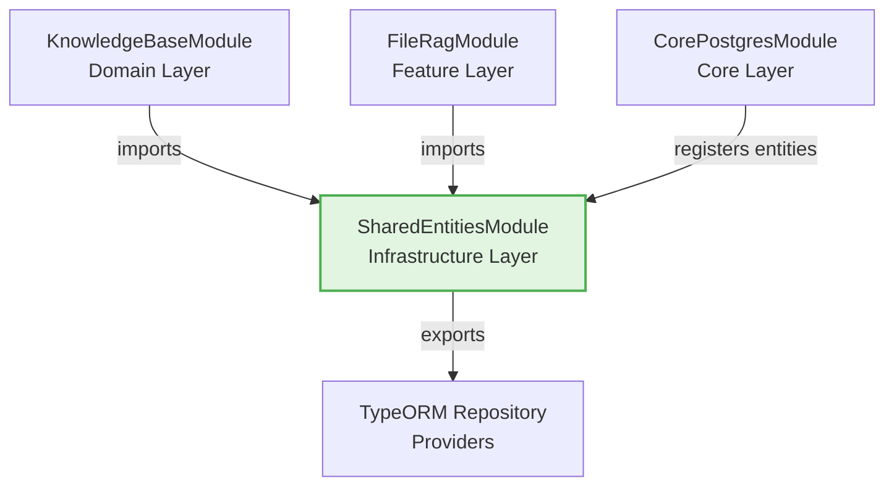

# Shared Entities Module

## Purpose

The `SharedEntitiesModule` provides TypeORM entities that are shared across multiple feature modules in the application. This module was created to break circular dependencies by centralizing entity definitions that are used by multiple domains.

## Design Philosophy

### Why Shared Entities?

**Problem:** When feature modules import entities from other feature modules, it creates tight coupling and circular dependencies:

```
FeatureA → imports Entity from FeatureB
FeatureB → imports Service from FeatureA
❌ Circular Dependency!
```

**Solution:** Extract shared entities into a dedicated module:

```
FeatureA → imports SharedEntitiesModule
FeatureB → imports SharedEntitiesModule
✅ No circular dependency!
```

### Principles

1. **Entities are infrastructure, not features** - Database entities represent data structure, not business logic
2. **Break cross-feature coupling** - Feature modules should not import from each other
3. **Single source of truth** - Each entity has one canonical location
4. **Maintain schema integrity** - Moving entities doesn't change database schemas

## Exported Entities

### DocumentChunkEntity

Represents a chunk of a document for RAG (Retrieval Augmented Generation).

**Used by:**
- `KnowledgeBaseModule` - For full-text search via `KeywordStoreService`
- `FileRagModule` - For document chunk persistence during ingestion
- `CorePostgresModule` - Registered in TypeORM root configuration

**Schema:**
```typescript
{
  id: string;                      // Primary key
  content: string;                 // Text content
  metadata: Record<string, any>;   // JSONB metadata
  sourceFileName?: string;         // Source file name
  sourceFileType?: string;         // File type (pdf, docx, etc.)
  sourceMetadata?: Record<string, any>; // Format-specific metadata
  searchVector: any;               // PostgreSQL tsvector (auto-generated)
}
```

## Usage

### Importing the Module

```typescript
import { Module } from '@nestjs/common';
import { SharedEntitiesModule } from '@app/shared-entities';

@Module({
  imports: [SharedEntitiesModule],
  // SharedEntitiesModule exports TypeOrmModule with registered entities
})
export class YourFeatureModule {}
```

### Injecting a Repository

```typescript
import { Injectable } from '@nestjs/common';
import { InjectRepository } from '@nestjs/typeorm';
import { Repository } from 'typeorm';
import { DocumentChunkEntity } from '@app/shared-entities';

@Injectable()
export class YourService {
  constructor(
    @InjectRepository(DocumentChunkEntity)
    private chunkRepo: Repository<DocumentChunkEntity>,
  ) {}

  async findChunks() {
    return this.chunkRepo.find();
  }
}
```

### Importing Just the Entity Type

If you only need the entity for type definitions (no repository injection):

```typescript
import type { DocumentChunkEntity } from '@app/shared-entities';

// Use for type annotations only
function processChunk(chunk: DocumentChunkEntity) {
  // ...
}
```

## Migration Guide

### Moving an Entity to Shared Entities

If you need to move an entity from a feature module to `SharedEntitiesModule`:

1. **Copy the entity file** to `libs/shared-entities/src/entities/`
2. **Update the entity exports** in `libs/shared-entities/src/entities/index.ts`
3. **Update all imports** across the codebase to use `@app/shared-entities`
4. **Add the entity** to `SharedEntitiesModule.imports`
5. **Remove the entity** from the old feature module
6. **Test thoroughly** - ensure no schema changes occurred

### Verifying No Schema Changes

```bash
# Generate a migration to see if schema changed
npm run typeorm:migration:generate -- -n VerifyNoChanges

# If the migration is empty, schema is intact ✅
# If the migration has changes, investigate ❌
```

## Architecture



## Best Practices

### ✅ DO

- Import `SharedEntitiesModule` when you need entity repositories
- Use `import type` for type-only imports
- Add comprehensive JSDoc comments to entities
- Version entities carefully (migrations required for schema changes)

### ❌ DON'T

- Import feature modules just to get entities
- Put business logic in entity classes
- Create circular dependencies through entity relationships
- Modify entity schemas without migrations

## Related Modules

- `CorePostgresModule` - Registers all entities with TypeORM
- `KnowledgeBaseModule` - Uses entities for keyword search
- `FileRagModule` - Uses entities for document ingestion

## Testing

Run tests for this module:

```bash
npm test -- shared-entities
```

## Future Entities

As the application grows, additional shared entities may be added:

- Session entities (if shared across auth and user modules)
- Audit log entities (if used by multiple features)
- Configuration entities (if persisted and shared)

Each entity should be evaluated: **Is it truly shared, or does it belong to a single feature?**
